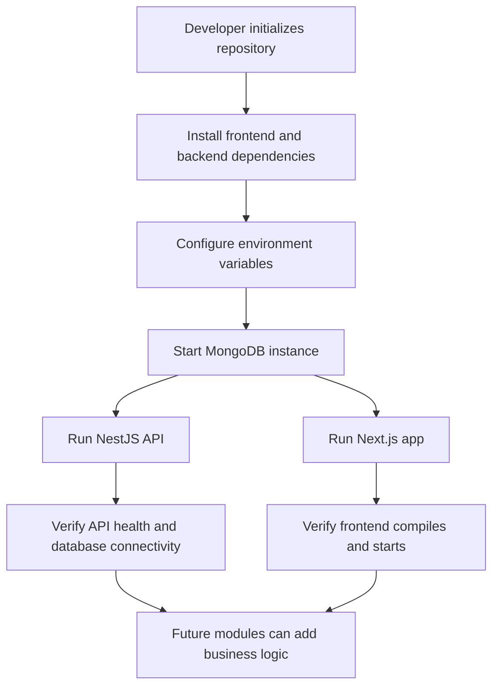

## 1. Product Overview
CrowdToLive is a full-stack property platform foundation prepared for future marketplace, registration, document, and administration workflows.
- This phase delivers a production-ready scaffold only: frontend and backend application shells, shared conventions, module-ready folder structures, environment handling, and development tooling.
- The goal is to let future feature teams add business logic into a stable architecture without reworking project foundations.

## 2. Core Features

### 2.1 User Roles
| Role | Registration Method | Core Permissions |
|------|---------------------|------------------|
| Visitor | None | Access public marketing and authentication entry points in future phases |
| Registered User | Email or invite-based registration in future phases | Manage profile, registrations, properties, and documents in future phases |
| Admin | Admin-created or promoted account in future phases | Manage users, properties, documents, and platform settings |

### 2.2 Feature Modules
1. **Application Shell**: shared frontend and backend foundations, feature-based modules, common configuration.
2. **Authentication Module**: reserved structure for auth flows, guards, DTOs, and frontend state.
3. **Registration Module**: reserved structure for onboarding and registration workflows.
4. **Users Module**: reserved structure for profiles, preferences, and account records.
5. **Properties Module**: reserved structure for property browsing and management.
6. **Documents Module**: reserved structure for file metadata and document workflows.
7. **Admin Module**: reserved structure for platform operations and moderation.
8. **Infrastructure Module**: environment variables, database connection, CORS, validation, logging, linting, formatting, and scripts.

### 2.3 Page Details
| Page Name | Module Name | Feature Description |
|-----------|-------------|---------------------|
| Root App Shell | App layout | Provides the global Next.js application frame, providers, and route grouping foundations without UI pages yet |
| Feature Route Groups | Authentication, Registration, Users, Properties, Documents, Admin | Creates predictable route folders and placeholders so future pages can be added consistently |
| API Root | NestJS bootstrap | Starts the API server with validation, CORS, environment loading, and versioning-ready structure |
| Backend Feature Modules | Authentication, Registration, Users, Properties, Documents, Admin | Creates module folders with controllers, services, schemas, DTO folders, and repository placeholders without business logic |
| Shared Configuration | Frontend and backend config | Centralizes environment access, constants, and developer experience tooling |

## 3. Core Process
The initial product process is infrastructure-first. Developers clone the repository, install dependencies, configure environment variables, start MongoDB, run both applications, and then add feature logic into predefined modules. End users do not interact with business workflows in this phase because only the application foundation is delivered.

## 4. User Interface Design
### 4.1 Design Style
- Primary colors: neutral slate foundation with a restrained blue accent for future UI system tokens
- Button style: reserved for future implementation; design tokens prepared centrally
- Fonts and sizes: use framework defaults initially and establish a scalable typography token structure later
- Layout style: App Router route groups and shared layout shell only, no business pages in this phase
- Icon style suggestions: use consistent outline icons in future UI modules, preferably `lucide-react`

### 4.2 Page Design Overview
| Page Name | Module Name | UI Elements |
|-----------|-------------|-------------|
| Root Layout | App shell | Metadata, global styles, providers, and a minimal placeholder composition boundary |
| Future Route Groups | Feature modules | Placeholder folders only; no visible business UI in this phase |

### 4.3 Responsiveness
Desktop-first project structure with responsive-ready Tailwind configuration. UI implementation is deferred, but the frontend shell is prepared for mobile-adaptive layouts in future iterations.
