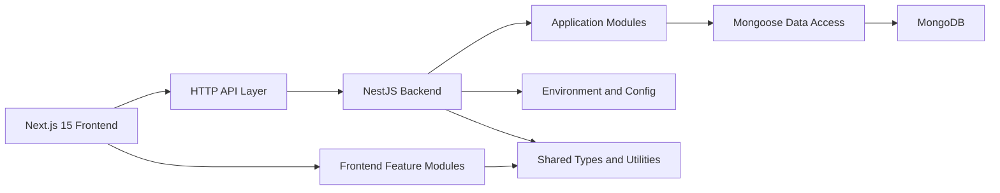
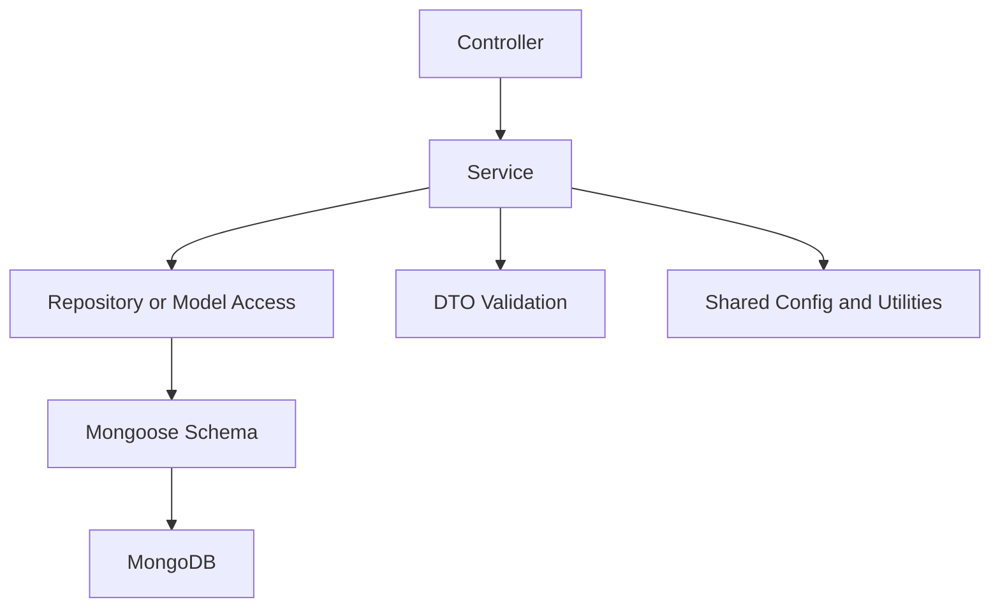
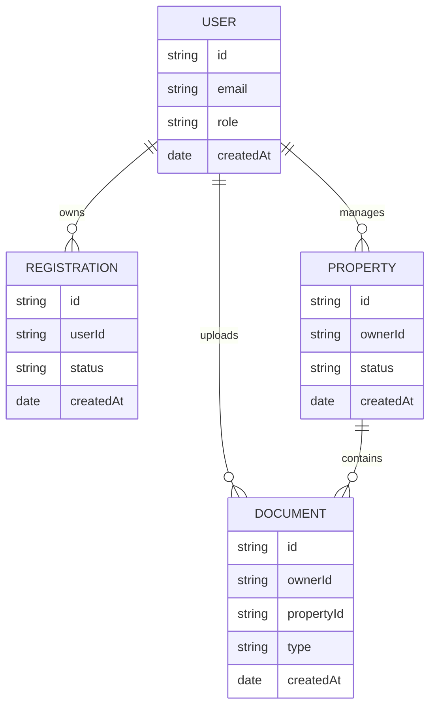

## 1. Architecture Design


## 2. Technology Description
- Frontend: Next.js 15 + React + TypeScript + Tailwind CSS + ESLint + Prettier
- Backend: NestJS + TypeScript + Mongoose + class-validator + class-transformer
- Database: MongoDB
- Workspace strategy: npm workspaces with `apps/web` and `apps/api`
- Runtime configuration: environment variables loaded per application with validation helpers
- Development quality: ESLint, Prettier, TypeScript strict mode, workspace scripts

## 3. Route Definitions
| Route | Purpose |
|-------|---------|
| / | Reserved root entry point and app shell only |
| /(auth) | Reserved group for authentication pages |
| /(registration) | Reserved group for registration and onboarding pages |
| /(users) | Reserved group for user account pages |
| /(properties) | Reserved group for property-related pages |
| /(documents) | Reserved group for document-related pages |
| /(admin) | Reserved group for administration pages |
| /api/health | Reserved backend health endpoint |

## 4. API Definitions
### 4.1 Shared API Conventions
```ts
export interface ApiSuccess<T> {
  success: true;
  data: T;
  timestamp: string;
}

export interface ApiError {
  success: false;
  message: string;
  statusCode: number;
  timestamp: string;
}
```

### 4.2 Bootstrap Endpoints
| Method | Endpoint | Purpose | Response |
|--------|----------|---------|----------|
| GET | /api/health | Confirms API boot status | `ApiSuccess<{ status: "ok" }>` |

### 4.3 Planned Module Endpoint Areas
| Module | Planned Endpoint Prefix |
|--------|-------------------------|
| Authentication | /api/auth |
| Registration | /api/registration |
| Users | /api/users |
| Properties | /api/properties |
| Documents | /api/documents |
| Admin | /api/admin |

## 5. Server Architecture Diagram


## 6. Data Model
### 6.1 Data Model Definition


### 6.2 Data Definition Language
MongoDB collections planned for future use:
- `users`
- `registrations`
- `properties`
- `documents`
- `admin_audit_logs`

Recommended index strategy for future implementation:
- `users.email` unique index
- `registrations.userId` index
- `properties.ownerId` index
- `documents.ownerId` index
- `documents.propertyId` index

## 7. Folder Structure
### 7.1 Workspace Layout
```text
CTL/
  apps/
    web/
    api/
  packages/
    shared/
  .trae/documents/
```

### 7.2 Frontend Structure
```text
apps/web/
  src/
    app/
      (auth)/
      (registration)/
      (users)/
      (properties)/
      (documents)/
      (admin)/
    features/
      auth/
      registration/
      users/
      properties/
      documents/
      admin/
    components/
      ui/
      layout/
    lib/
    config/
    types/
```

### 7.3 Backend Structure
```text
apps/api/src/
  common/
    config/
    database/
    dto/
    filters/
    interceptors/
    pipes/
  modules/
    auth/
    registration/
    users/
    properties/
    documents/
    admin/
  health/
```

## 8. Environment Variables
### 8.1 Frontend
| Variable | Purpose |
|----------|---------|
| NEXT_PUBLIC_API_BASE_URL | Public base URL for the NestJS API |
| NEXT_PUBLIC_APP_NAME | Public display name for the platform |

### 8.2 Backend
| Variable | Purpose |
|----------|---------|
| NODE_ENV | Runtime mode |
| PORT | API server port |
| MONGODB_URI | MongoDB connection string |
| CORS_ORIGIN | Allowed frontend origin |
| APP_NAME | Application name |

## 9. Operational Requirements
- Enable strict TypeScript in both applications.
- Add CORS configuration in NestJS using `CORS_ORIGIN`.
- Add MongoDB bootstrap using `MongooseModule.forRootAsync`.
- Keep module folders reusable and business-logic free in this phase.
- Add workspace scripts for development, build, lint, format, and typecheck.
- Verify scaffold by running both applications successfully after dependency installation.
