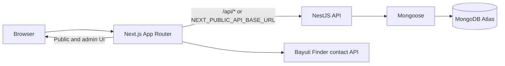

# CrowdToLive Developer Guide

## 1. System overview

CrowdToLive is a TypeScript npm-workspaces monorepo for a property/home-ownership platform. It ships a Next.js public and admin web app, a NestJS REST API, and MongoDB persistence through Mongoose. Vercel serves both applications from one deployment configuration: browser requests to `/api/*` run the Nest serverless handler and all other requests resolve to Next.js.



## 2. Repository layout

```text
CTL/
├─ apps/
│  ├─ api/                         NestJS backend
│  │  ├─ src/common/               configuration, Mongo, filters, interceptors
│  │  ├─ src/health/               health endpoint
│  │  ├─ src/modules/              domain modules
│  │  ├─ src/scripts/              operational scripts, including admin seeding
│  │  ├─ src/main.ts               Nest factory and common HTTP configuration
│  │  ├─ src/server.ts             local server entry point
│  │  └─ src/vercel.ts             Vercel serverless handler
│  └─ web/                         Next.js application
│     ├─ src/app/                  App Router routes, layouts, route handlers
│     ├─ src/features/             feature-owned UI, data, types, and styles
│     ├─ src/components/           reusable layout/provider components
│     ├─ src/config/               public browser environment configuration
│     ├─ src/lib/                  cross-feature client helpers
│     └─ public/                   local images and SVG assets
├─ packages/shared/                shared API envelope and feature types
├─ .trae/documents/                historical PRD/architecture documents
├─ package.json                    workspace commands and package declaration
└─ vercel.json                     combined web/API deployment routes
```

The `_design` directory under `apps/web` is reference/design material, not runtime source. Application features live under `apps/web/src/features`; new UI should normally follow that convention rather than growing route files.

## 3. Frontend architecture

The frontend uses Next.js 15 App Router and React 19. App route files mainly define metadata, perform server-side session checks/redirects where needed, and render a feature component. Interactive screens use client components, local state, native `fetch`, CSS Modules, and Tailwind v4 utilities.

- `src/app/layout.tsx` is the root layout: global styles, Geist fonts, and `AppProviders`.
- `src/config/env.ts` validates browser-visible `NEXT_PUBLIC_*` variables through Zod.
- `src/features/admin` contains all admin auth/session helpers and admin views.
- `src/features/registration-qualification` owns the public wizard, reusable searchable selects, phone validation, and qualification footer.
- `src/features/homepage` owns the main marketing page content/config and view.
- `src/features/landing` implements configurable generic landing templates; `amana-landing` and `bayuti-finder` are standalone feature implementations.

### Frontend routes

| Route | Purpose |
|---|---|
| `/` | CrowdToLive public homebuyer marketing page. |
| `/register` | Multi-step qualification and registration intake. |
| `/register/not-qualified` | Follow-up state after the present registration submission flow. |
| `/admin/login` | Admin sign-in; redirects authenticated users to the dashboard. |
| `/admin/dashboard` | Protected registration-management dashboard. |
| `/admin/dashboard/registrations/[id]` | Protected registration review/status-update page. |
| `/api/admin/session` | Next route handler that creates/removes the web app’s admin session cookie. |
| `/landing/[variant]` | Static generic landing pages selected from configuration. |
| `/landing/amana-home-deposit-builder` | Amana marketing page. |
| `/landing/bayuti-finder` | Bayuti Finder verification/dashboard landing page. |

The valid generic landing variants are:

- `/landing/crowdtolive-startup-bayuti`
- `/landing/crowdtolive-charity-bayuti`
- `/landing/crowdtolive-academy-bayuti`
- `/landing/crowdtolive-case-studies`

They are exposed by `generateStaticParams`; unknown variants return a 404.

## 4. Backend architecture

`AppModule` is the composition root. It loads global environment configuration, Mongoose, Health, Auth, Registration, Users, Properties, Documents, and Admin modules.

The API applies these global HTTP conventions in `main.ts`:

- Configured CORS with credential support. `CORS_ORIGIN` accepts a comma-separated allow-list; localhost origins are additionally accepted in development.
- `ValidationPipe` with whitelist and transformation enabled.
- `AllExceptionsFilter`, returning a consistent error envelope.
- `SuccessResponseInterceptor`, wrapping normal successful responses as `{ success, data, timestamp }`.

Controllers are deliberately thin. Services own persistence and business behavior; DTOs use `class-validator`; Mongoose schemas declare collections and indexes.

`server.ts` binds the application for local development. `vercel.ts` obtains and caches the Express adapter so the same Nest application can serve Vercel serverless requests.

## 5. API reference

All successful API endpoint responses are wrapped as:

```ts
{ success: true, data: T, timestamp: string }
```

All failures use `{ success: false, statusCode, message, timestamp }`.

| Method | Endpoint | Authentication | Description |
|---|---|---|---|
| `GET` | `/api/health` | None | Returns `{ status: "ok", database }`, where database is Mongoose connection state. |
| `POST` | `/api/register` | None | Validates and creates a registration. |
| `POST` | `/api/admin/login` | None | Verifies admin credentials, signs a JWT, returns admin metadata/token, and sets the configured API cookie. |
| `POST` | `/api/admin/logout` | None | Clears the configured API cookie. |
| `GET` | `/api/admin/registrations` | Admin JWT | Lists registrations. Supports `page`, `limit` (1–50), `search` (email/city), and `status`. Includes pagination, filter echo, and overall status counts. |
| `GET` | `/api/admin/registrations/:id` | Admin JWT | Returns a registration or 404. |
| `PATCH` | `/api/admin/registrations/:id/status` | Admin JWT | Updates status to `NOT_QUALIFIED`, `QUALIFIED`, or `PENDING`. |

Admin-protected requests accept either a `Bearer` token or the configured admin auth cookie. API client code must consume the success envelope rather than assuming endpoint results are returned directly.

## 6. Database models

### `admins`

`Admin` is a timestamped Mongoose model in the `admins` collection.

| Field | Notes |
|---|---|
| `email` | Required, trimmed, lowercased, unique indexed string. |
| `password` | Required bcrypt hash, excluded from standard selections. |
| `role` | Required enum; currently only `SUPER_ADMIN`. |
| `createdAt`, `updatedAt` | Mongoose timestamps. |

### `registrations`

`Registration` is a timestamped model in `registrations`.

| Field | Type |
|---|---|
| `propertyFound`, `jointApplication` | Required boolean. |
| `deposit`, `propertyPrice`, `annualSalary` | Required number. |
| `city`, `email` | Required string. Email is validated by the request DTO. |
| `status` | `NOT_QUALIFIED` (default), `QUALIFIED`, or `PENDING`. |
| `createdAt`, `updatedAt` | Mongoose timestamps. |

Indexes exist for newest records, status/newest records, email, and city. Mongoose has `autoIndex: false`; production index creation must therefore be managed deliberately instead of relying on application startup.

`UsersModule`, `PropertiesModule`, and `DocumentsModule` are registered but currently empty: there are no associated models or endpoints.

## 7. Authentication flow

1. Run `npm run seed:admin -w @crowdtolive/api` to create the initial super-admin when no admin exists. It sources credentials from the environment.
2. The admin login form submits credentials to `POST /api/admin/login`.
3. The API finds the lowercased email, selects the stored password hash, verifies it with bcrypt, and signs a JWT containing `sub`, `email`, and `role`.
4. Nest sets an HTTP-only cookie and returns the JWT in the response data.
5. The client posts that token to Next’s same-origin `/api/admin/session`; the route handler sets an HTTP-only session cookie for server rendering.
6. Admin route files call `getAdminSession()`, which reads the cookie and verifies its JWT signature with `jose` and `JWT_SECRET`. Invalid/no session redirects to `/admin/login`.
7. Admin dashboard browser requests send credentials to the Nest API. `AdminJwtAuthGuard` validates its cookie or a Bearer token.
8. Sign out deletes the Next session cookie and calls the API logout endpoint to clear the API cookie.

Keep `JWT_SECRET` and `ADMIN_AUTH_COOKIE_NAME` consistent between the Next and Nest environments. Same-origin Vercel routing is the intended production topology; if the API is hosted separately, review cookie domain, `SameSite`, CORS, and credentials behavior before deployment.

## 8. Registration flow

The public wizard first gathers and locally validates first name, last name, email, country selection, and an international phone number using `libphonenumber-js`. It then guides the user through:

1. Property already found?
2. Deposit amount
3. Intended city
4. Property price
5. Joint vs. sole application
6. Annual salary
7. Email confirmation

At the final step it posts the persisted qualification fields to `POST /api/register`. The registration service creates a `registrations` document, which defaults to `NOT_QUALIFIED`, and returns the identifier. The browser writes registration id/status to `sessionStorage` and navigates to `/register/not-qualified`. The admin dashboard then allows an authorized administrator to inspect and update the record status.

Currently, initial contact fields (first/last name, country, phone) are only client-side data; they are not part of the request DTO or MongoDB schema. There is no distinct qualified user-facing destination yet.

## 9. Admin dashboard

The dashboard is composed from reusable `AdminShell`, `AdminDashboardView`, `RegistrationDetailsView`, and `AdminLoginForm` components.

- The list fetches registrations client-side with page/limit/search/status query parameters.
- It displays global total/qualified/pending/not-qualified counts.
- Search matches email or city; the backend safely escapes user search text for Mongo regex queries.
- A detail page displays full submitted values and performs status updates through the protected PATCH endpoint.
- Dashboard and Registrations navigation are live. Customers, Reporting, and Settings are intentionally marked “Soon” and have no routes/behavior.

## 10. Landing pages and integrations

- The homepage renders its content from `homepage/content.ts`, including remote video/image resources and external Bayuti social links.
- `features/landing/variants.ts` provides four static generic, configurable landing pages: startup, charity, academy/SEO, and case studies/testimonials.
- `features/amana-landing` is a tailored Amana product landing page. Its visible registration/CTA fields are presentation-only at present; no submission API is wired up.
- `features/bayuti-finder` posts a supplied email to `https://finder.bayuti.com/api/check-contact`. It interprets the returned contact data and displays submitted property URLs; the full third-party property search remains outside this repository.

## 11. Environment variables

Set production values in Vercel project environment settings; do not commit credentials. `apps/api/.env.example` documents the backend variables.

| Variable | Used by | Purpose |
|---|---|---|
| `NODE_ENV` | API/web runtime | Environment mode. |
| `PORT` | API | Local Nest server port; defaults to 4000. |
| `APP_NAME` | API | API identity. |
| `MONGODB_URI` | API | Atlas/local MongoDB connection. |
| `CORS_ORIGIN` | API | Permitted frontend origins. |
| `JWT_SECRET` | API + Next server | JWT signing and server-side verification secret. |
| `JWT_EXPIRES_IN` | API | JWT expiry setting. |
| `ADMIN_AUTH_COOKIE_NAME` | API + Next server | Admin cookie name. |
| `ADMIN_SEED_EMAIL`, `ADMIN_SEED_PASSWORD` | API seed script | Initial administrator credentials. |
| `NEXT_PUBLIC_API_BASE_URL` | Browser web code | API base URL. Use the production origin/routing topology. |
| `NEXT_PUBLIC_APP_NAME` | Browser web code | Public app name. |

The code contains development defaults for some sensitive API variables. They are conveniences for local work only; production must supply secure values.

## 12. Deployment and operational flow

1. Vercel builds the Next app from `apps/web/package.json` with `@vercel/next`.
2. Vercel builds `apps/api/src/vercel.ts` with `@vercel/node`.
3. Vercel sends `/api/*` to the Nest handler first, serves Next filesystem assets next, then routes other paths to Next.
4. The Nest serverless entry initializes/caches the app, validates environment values, enables CORS/validation/interceptors/filters, and connects via Mongoose.
5. Ensure Vercel has the Mongo Atlas URI, JWT secret, allowed CORS origin, and matching frontend API base URL before promoting a deployment.

Because GitHub is connected to Vercel, pushes to `main` can deploy automatically. Confirm behavior with local checks before merging.

```bash
npm install
npm run dev
npm run typecheck
npm run lint
npm run build
npm run seed:admin -w @crowdtolive/api
```

## 13. Development rules

- Preserve the App Router + feature-folder architecture.
- Keep route files thin and colocate feature-specific components, styles, types, and content inside the feature folder.
- Reuse `clientEnv`, shared API envelope types, auth helpers, admin shell, and registration controls rather than duplicating them.
- Preserve API response envelopes and DTO/schema/service/controller boundaries.
- Do not add new environment variables without documenting their Vercel configuration and deployment effect.
- Do not refactor working code as part of unrelated work. Keep each change scoped and validate it before a deployment-sensitive push.
