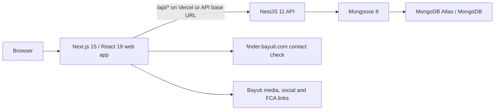

# CrowdToLive Project Overview

## Purpose and current scope

CrowdToLive is an npm-workspaces monorepo for a property/home-ownership platform. It combines a Next.js public/admin web application, a NestJS API, and MongoDB Atlas-compatible persistence. The repository has evolved beyond its original scaffold documentation: the home page, qualification registration workflow, registration persistence, and an admin registrations console are implemented. Users, properties, documents, and several operational dashboard sections remain planned.

## Architecture



- Root workspace scripts run, build, lint, type-check, and format the three packages together. Node.js 20+ is required.
- `apps/web` uses the Next.js App Router. Route files are thin server components that compose feature modules; interactive views are client components.
- `apps/api` is a Nest application with controller/service/schema layering, Zod configuration validation, Mongoose models, global request validation, CORS, and standardized API envelopes.
- `packages/shared` provides the `ApiSuccess`, `ApiError`, and feature-module TypeScript contracts. It is currently intentionally small.

## Folder organisation

```text
CTL/
├─ apps/
│  ├─ web/                         Next.js application
│  │  ├─ src/app/                  App Router routes and the local session route
│  │  ├─ src/features/             Feature-owned UI, content, styles, and client logic
│  │  ├─ src/components/           Cross-feature provider/layout components
│  │  ├─ src/config/               Public client environment validation
│  │  └─ public/                   Local logos, SVGs, and qualification imagery
│  └─ api/                         NestJS application
│     └─ src/
│        ├─ common/                environment, Mongo, error, and response infrastructure
│        ├─ health/                health endpoint
│        ├─ modules/               auth, registration, admin, plus planned modules
│        └─ scripts/               one-time admin seed command
├─ packages/shared/                Shared API/feature TypeScript types
├─ vercel.json                     Combined Vercel deployment routing
└─ .trae/documents/                Earlier PRD and architecture documents (partly stale)
```

`apps/web/_design` contains source/reference captures for the designs, not application runtime code. `CTL-Project.zip` is ignored by Git.

## Frontend architecture and routes

The root layout applies Geist fonts, global Tailwind v4 CSS, metadata, and a currently pass-through provider. Feature folders own their presentation and local types; most styling is CSS Modules, with Tailwind utilities used heavily in the admin UI.

| Route | Implementation | Behaviour |
|---|---|---|
| `/` | `homepage` feature | Public CrowdToLive marketing/homebuyer page with remote video/images, FAQs, social links, and CTA to registration. |
| `/register` | `registration-qualification` | Client-side eight-part intake: contact details, property status, deposit, city, property price, joint application, salary, and email. |
| `/register/not-qualified` | `registration-qualification` | Static follow-up page linking to app stores. |
| `/admin/login` | `admin` feature | Server checks the local admin session and otherwise renders the admin login form. |
| `/admin/dashboard` | `admin` feature | Protected registration list with counts, search, filter, pagination, and detail links. |
| `/admin/dashboard/registrations/[id]` | `admin` feature | Protected registration detail and status-update page. |
| `/api/admin/session` | Next route handler | Sets/deletes the web application's HTTP-only admin JWT cookie. |
| `/landing/[variant]` | `landing` feature | Statically generated generic landing variants from `variants.ts`; unknown variants return 404. |
| `/landing/amana-home-deposit-builder` | `amana-landing` | Dedicated Amana marketing/calculator-style page. |
| `/landing/bayuti-finder` | `bayuti-finder` | Email-verification shell and display of a verified contact's submitted property links. |

The generic landing routes are content/config driven. The two dedicated landing pages are independently implemented and styled. The homepage and qualification pages use local branding assets plus externally hosted Bayuti media.

## Backend architecture and API

`AppModule` loads validated environment configuration, Mongo/Mongoose, health, auth, registration, users, properties, documents, and admin modules. Nest applies a global whitelist/transform `ValidationPipe`, an exception filter, and a success interceptor. Successful responses are wrapped as:

```ts
{ success: true, data: T, timestamp: string }
```

Failures have `{ success: false, statusCode, message, timestamp }`. The exception filter serializes structured Nest errors into `message`, so clients need to parse validation details when desired.

| Method | Endpoint | Auth | Function |
|---|---|---|---|
| `GET` | `/api/health` | No | Returns API status and Mongoose connection state. |
| `POST` | `/api/register` | No | Validates and stores a registration record. |
| `POST` | `/api/admin/login` | No | Validates seeded admin credentials, signs a JWT, and sets an API cookie. |
| `POST` | `/api/admin/logout` | No | Clears the API auth cookie. |
| `GET` | `/api/admin/registrations` | Admin JWT | Lists registrations with `page`, `limit` (max 50), optional `search`, optional status, pagination, and aggregate status counts. |
| `GET` | `/api/admin/registrations/:id` | Admin JWT | Returns one registration. |
| `PATCH` | `/api/admin/registrations/:id/status` | Admin JWT | Changes status to `NOT_QUALIFIED`, `QUALIFIED`, or `PENDING`. |

The guard accepts a Bearer token or the configured cookie. Admin queries search email/city using escaped case-insensitive regexes and validate ObjectIds before individual lookups.

## Database models

### `admins` collection

- `email`: normalized lowercase string; unique indexed.
- `password`: bcrypt hash, excluded from normal query selection.
- `role`: presently only `SUPER_ADMIN`.
- Mongoose timestamps: `createdAt`, `updatedAt`.

`npm run seed:admin -w @crowdtolive/api` creates one super-admin from environment variables only if the collection is empty.

### `registrations` collection

- `propertyFound`, `jointApplication`: required booleans.
- `deposit`, `propertyPrice`, `annualSalary`: required numbers.
- `city`, `email`: required strings (`email` has DTO email validation).
- `status`: `NOT_QUALIFIED` by default, alternatively `QUALIFIED` or `PENDING`.
- Mongoose timestamps.
- Indexes: `createdAt` descending; compound `status, createdAt`; `email`; `city`.

No User, Property, Document, or audit-log schema currently exists, despite empty Nest modules and older planning documents referring to them.

## Authentication and admin flow

1. An administrator is created by the seed command with a bcrypt password hash.
2. The login form calls the Nest login endpoint. Nest verifies the password, signs a JWT containing `sub`, `email`, and `role`, and returns it in the success envelope.
3. The browser posts that token to the same-origin Next `/api/admin/session` route, which stores an HTTP-only, `SameSite=Lax` web cookie.
4. Server-rendered admin routes use `jose` and `JWT_SECRET` to verify that web cookie before redirecting to login or rendering the page.
5. Admin browser requests include credentials to the Nest API; its guard accepts the API-domain cookie (or a Bearer header).
6. Logout clears both the web cookie and the Nest API cookie.

In Vercel production, `vercel.json` routes `/api/*` to the Nest handler and all other paths to Next, enabling same-origin deployment when `NEXT_PUBLIC_API_BASE_URL` is set accordingly. CORS permits the comma-separated `CORS_ORIGIN` list and local hosts during development.

## Registration flow

The qualification wizard initially validates first name, last name, email, country, and a country-aware phone number locally. It then validates each subsequent field locally and posts only the seven modelled qualification fields to `POST /api/register`. On success it stores the returned registration id/status in `sessionStorage` and navigates to the not-qualified page. Admin staff can later inspect and revise status.

## Environment configuration

Never commit actual secrets; `.env.local` is ignored. The API example defines:

| Variable | Purpose |
|---|---|
| `NODE_ENV`, `PORT`, `APP_NAME` | Runtime and service identity. |
| `MONGODB_URI` | Atlas/local Mongo connection URI. |
| `CORS_ORIGIN` | Comma-separated permitted frontend origins. |
| `JWT_SECRET`, `JWT_EXPIRES_IN` | Admin JWT signing/verification. |
| `ADMIN_AUTH_COOKIE_NAME` | Cookie name used by Nest and Next. |
| `ADMIN_SEED_EMAIL`, `ADMIN_SEED_PASSWORD` | Initial admin seed account. |
| `NEXT_PUBLIC_API_BASE_URL` | Browser-visible Nest API base URL (web). |
| `NEXT_PUBLIC_APP_NAME` | Browser-visible app name (web). |

The backend Zod schema currently supplies development defaults, including a default JWT secret and seed credentials; production must set strong values explicitly. The frontend validates its public values through Zod, defaulting the API to `http://localhost:4000`.

## Deployment and local operations

`vercel.json` builds `apps/web` via `@vercel/next` and exposes `apps/api/src/vercel.ts` through `@vercel/node`. It routes API traffic before the Next filesystem and page routing. The Nest entry reuses a cached initialized Express/Nest adapter for serverless invocations.

Useful commands:

```bash
npm install
npm run dev                 # web and API concurrently
npm run dev:web             # Next only
npm run dev:api             # Nest only
npm run seed:admin -w @crowdtolive/api
npm run typecheck
npm run lint
npm run build
```

## Completed functionality

- Responsive CrowdToLive homepage and qualification visual flow.
- Public registration submission to MongoDB.
- Health endpoint, global response/error conventions, CORS, DTO validation, and Mongo configuration.
- Admin seeding, bcrypt credential verification, JWT auth, server-side page gating, session cookies, logout.
- Admin registration statistics, search/filter/pagination, record details, and workflow-status editing.
- Generic and dedicated Bayuti/Amana landing pages.
- Bayuti Finder integration with `https://finder.bayuti.com/api/check-contact` to verify a contact and render returned saved-property links.
- Workspace-level type checking currently passes for shared, API, and web packages.

## Pending, placeholder, and non-functional areas

- `UsersModule`, `PropertiesModule`, and `DocumentsModule` are empty: no endpoints, schemas, UI, authorization, or business flow.
- Admin navigation labels Customers, Reporting, and Settings as “Soon”; their links are `#`.
- The wizard collects first/last name, country, and phone but does not persist them or send them to the API.
- The API always creates `NOT_QUALIFIED` and the client always redirects to the not-qualified route, including if a future response says otherwise; there is no implemented qualified/pending public outcome.
- Amana’s displayed registration/CTA fields and calculator are presentation-only: they do not submit or persist data. Its privacy/terms/risk links are `#`.
- Bayuti Finder intentionally excludes the full third-party property-search workflow; it only calls the external contact-check endpoint and shows returned links.
- Generic landing-page form fields do not submit; their CTA links to `/register`.
- No automated unit, integration, API, or end-to-end tests are present.

## Technical debt and inconsistencies observed

- The checked-in `apps/web/README.md` and `.trae` PRD/architecture describe an earlier scaffold and inaccurately say the app has no business logic. This document reflects the current code.
- User-entered numeric qualification fields are only checked for non-empty values on the client and `IsNumber` on the server. There are no positivity, range, currency, or affordability validations.
- Registration email normalization/duplicate policy is not implemented; repeated submissions are allowed and city is free text.
- `MongoConnectionService` duplicates connection logic but is not registered as a provider; the effective connection is `MongooseModule.forRootAsync`.
- The admin guard verifies JWT validity but does not verify that the referenced admin still exists, is active, or holds a currently authorized role.
- The same JWT is stored by both the API and Next. This works best with same-origin Vercel routing; a separately hosted API requires deliberate cookie-domain/SameSite/CORS design and validation.
- `NEXT_PUBLIC_API_BASE_URL` must be correctly aligned with Vercel routing. A different production origin may prevent the API cookie from accompanying protected browser requests.
- The default JWT secret and default seed password are unsafe if deployment secrets are omitted.
- `autoIndex: false` means declared Mongo indexes are not automatically created in production; index provisioning needs an explicit deployment/migration process.
- Several user-facing strings have mojibake characters (for example `’` and `®`), likely an encoding issue.
- Next images are globally `unoptimized`, reducing image optimisation benefits; multiple marketing media assets are remote and therefore external availability/performance dependencies.
- The API manually re-validates the registration DTO after the global validation pipe already runs; it is redundant, though it additionally forbids unknown fields.

## Change-control status

No application, configuration, dependency, or database changes were made during the audit. This file is the only requested repository addition. Await approval of this understanding before implementing project changes.
